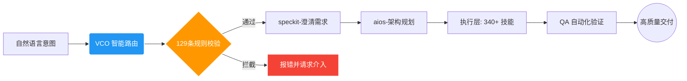

  <a href="./README.en.md">🇬🇧 English</a> | <b>🇨🇳 中文</b>

  

  

    
    
    
  

  
  
  
  

    
    
    
  

   

  <h3 align="center"><b>不只是技能集合，更是你的个人 AI 操作系统</b></h3>
  

    集成数百个 Skills、MCP 入口与治理规则的工业级运行时框架。
  

  

    🧠 规划 · 🛠️ 工程 · 🤖 AI · 🔬 科研 · 🧬 生命科学 · 🎨 可视化 · 🎬 多媒体
  

---

 

> [!IMPORTANT]  
> **🎯 我们的核心愿景:**
> 降低面对新技术的认知焦虑与高昂的学习成本。在这里，无论你是否具备深厚的编程基础，都能以极低的门槛，直接调用当今最前沿的 AI 技术集合。**让每个人都能享受 AI 带来的生产力飞跃。**

### 📊 为什么说它强大？

**VibeSkills** 背后的运行时核心是 **VCO**。它绝不仅仅是一个单点工具或只会“补代码”的脚本，而是一个已经完成高度整合与治理的**超级能力网络**：

|                                                🧩 技能模块                                                |                                           🌍 生态融合                                           |                                                ⚖️ 治理规则                                                 |
| :-------------------------------------------------------------------------------------------------------: | :---------------------------------------------------------------------------------------------: | :--------------------------------------------------------------------------------------------------------: |
| <h2 align="center">340+</h2>
可直接调用的 Skills，覆盖从需求规划到执行的完整链路
 | <h2 align="center">19+</h2>
吸收与借鉴高价值上游开源项目与最佳实践来源
 | <h2 align="center">129 条</h2>
基于配置的策略与契约，确保执行稳定、可溯源、防发散
 |

---

## ✨ 为什么它与众不同？

传统的 Skills 仓库在回答：_“我这里有什么工具？”_ 而 VibeSkills 正面迎击的是重度 AI 用户的核心痛点：_“我该怎么稳定地完成工作？”_

| ❌ 传统痛点（你可能经历过）                                                                                                                                                            | ✅ VibeSkills 解法（我们正在做）                                                                                                                                                     |
| :------------------------------------------------------------------------------------------------------------------------------------------------------------------------------------- | :----------------------------------------------------------------------------------------------------------------------------------------------------------------------------------- |
| **技能沉睡**：仓库里几百个能力，真实场景下 AI 根本想不起来用，激活率极低。                                                                                                             | **🧠 智能路由**：现在该调什么，系统会根据上下文和逻辑自动路由拉起，无需你翻背技能表。                                                                                                |
| **黑盒狂奔**：AI 不澄清需求就直接开做，速度快但方向偏，项目逐渐变成黑盒。                                                                                                              | **🧭 受管工作流**：先做什么再做什么被严格约束。将澄清、验证、留痕收进统一流程，每步可溯源。                                                                                          |
| **互相冲突**：不同插件和工作流之间缺乏统筹，导致环境污染或死循环。                                                                                                                     | **🧩 全局治理**：通过 129 条契约规则，设定安全边界与回退机制，保障整个运行时的长期稳定性。                                                                                           |
| AI的工作区往往不够规范，工作久了之后仓库容易脏乱差，影响下一个agent接手工作区。在开一个新agent管理工作项目时，重新理解工作区的架构会遗漏一些项目细节，导致后面工作和前面工作衔接有问题 | 使用了一套文件目录语义治理。保证只要工作经过这个项目的治理，按固定化的架构存储文件，让下一个新的对话的AI明白什么什么目录下存储什么什么文件                                           |
| AI诸多的小毛病：为删除备份，把主要文件删了；喜欢写静默的兜底机制，然后早早的自信满满的给你说做好了，实际上全是兜底机制在发力，主要功能实现度度很差                                     | 内置了一些治理，如上述的禁止按命令批量删除文件，只能一个文件一个文件的删除，防止误删文件。禁止写自动静默兜底机制，如果要写兜底机制，一定要显示有明确的警告用户                       |
| 用户需要依据经验自己规范与AI的工作流，需要学习和保持警觉                                                                                                                               | 框架会引导用户，从沟通好需求，沟通好落实计划，固定好工作步骤文件，多代理并发执行（同时会按照计划，不同的代理分配不同的工作，各自会自动调用相关的skills），自动测试迭代，直到任务完成 |

**集合了这么多skills，是否会因为选项过多导致token爆炸？
在治理框架下肯定会导致多余的token消耗，但是不会至于token爆炸。因为路由不是给模型如此多的选项，而是依据用户的任务触发，核心是用户命令-ai辅助治理发掘用户意图的关键词-关键词触发技能路由，这样调用路由。**

---

## ✦ 全景能力地图：你的全能工作台

如果把这 340 个 skills 按“真实工作流”展开，VibeSkills 已经为你铺设好了一条端到端的能力链。
 
| 能力域 | 覆盖工作面 | 代表能力引擎 |
| :--- | :--- | :--- |
| **💡 需求与澄清** | 拒绝黑盒开局：把模糊想法转为边界清晰、可验收的问题定义 | `brainstorming`, `speckit-clarify` |
| **📋 规划与拆解** | 将宏大目标拆解为 spec、plan、tasks、里程碑与执行流 | `writing-plans`, `speckit-specify`, `aios-po` |
| **🏗️ 架构与选型** | 设计前后端边界、接口、数据层、部署层与技术路线对比 | `aios-architect`, `architecture-patterns` |
| **💻 开发与实现** | 新功能开发、脚手架搭建、工程化集成和跨文件精准落地 | `autonomous-builder`, `speckit-implement` |
| **🔧 调试与重构** | 告别表面缝补：定位报错、分析根因、恢复项目级可维护性 | `error-resolver`, `systematic-debugging` |
| **🛡️ 测试与品控** | 单元测试、回归验证、质量门禁，实现“完成前强制核验” | `tdd-guide`, `aios-qa`, `code-review` |
| **🚀 协作与发布** | 接管 Issue/PR、CI 修复、Review 处理与自动化部署 | `aios-devops`, `gh-fix-ci`, `vercel-deploy` |
| **🤖 复合工作流** | 冻结需求、任务分派、多 Agent 协同、执行留痕与环境清理 | `vibe`, `swarm_*`, `hive-mind-advanced` |
| **🔌 外部生态接入** | 打通浏览器、网页抓取、设计稿、第三方服务与上下文记忆 | `mcp-integration`, `playwright`, `scrapling` |
| **📊 数据与 AI 工程** | 涵盖 EDA、清洗统计，到模型训练、RAG 检索与实验跟踪 | `senior-ml-engineer`, `statistical-analysis` |
| **🔬 科研与生命科学** | **强势领域**：文献检索综述、生信分析、单细胞、药物发现 | `literature-review`, `biopython`, `scanpy` |
| **📐 数学与专业计算** | 符号推导、贝叶斯建模、多目标优化、仿真乃至量子计算 | `sympy`, `pymc-bayesian-modeling`, `qiskit` |
| **🎨 多媒体与展示** | 交互图表、科研绘图、图片生成、语音合成与视频素材生产 | `plotly`, `generate-image`, `video-studio` |
 

<b>👉 点击展开：探索 VibeSkills 完整的 340+ 全栈能力矩阵详解</b>

 
<blockquote>
<i>💡 <b>治理的意义</b>：以下庞大的技能库不是孤立的脚本死水，而是一个被 VCO 运行时接管的生态。通过领域矩阵分类，系统会在正确的上下文节点自动唤起正确的工具，无需你手动遍历调用。</i>
</blockquote>

### 🧠 需求、规划与产品管理

> **🎯 让大想法变得可落地**：负责需求洞察、问题定义、Sprint 规划、任务切分与约束收集。确保在写下第一行代码前，方向清晰、边界明确且具有可验收的里程碑。

`.system`, `aios-pm`, `aios-po`, `aios-sm`, `aios-squad-creator`, `aios-ux-design-expert`, `brainstorming`, `create-plan`, `designing-experiments`, `planning-with-files`, `shared-templates`, `speckit-analyze`, `speckit-checklist`, `speckit-clarify`, `speckit-constitution`, `speckit-plan`, `speckit-specify`, `speckit-tasks`, `speckit-taskstoissues`, `subagent-driven-development`, `think-harder`, `treatment-plans`, `ux-researcher-designer`, `writing-plans`

---

### 🛠️ 软件工程与架构设计

> **🎯 真正的工程化构建底座**：从脚手架搭建、跨文件修改、API 接口设计到微服务架构评估。不仅产出代码，更负责上下文记忆、工具链编排与智能 Agent 的多阶段协同执行。

`aios-architect`, `aios-dev`, `aios-master`, `architecture-patterns`, `autonomous-builder`, `cancel-ralph`, `coding-tutor`, `context-fundamentals`, `context-hunter`, `cs-foundations`, `deepagent-memory-fold`, `deepagent-toolchain-plan`, `evaluating-code-models`, `get-available-resources`, `hive-mind-advanced`, `local-vco-roles`, `node-zombie-guardian`, `nowait-reasoning-optimizer`, `prompt-lookup`, `ralph-loop`, `skill-creator`, `skill-lookup`, `spec-kit-vibe-compat`, `speckit-implement`, `superclaude-framework-compat`, `theme-factory`, `vibe`, `webthinker-deep-research`

---

### 🔧 调试、测试与质量保证

> **🎯 守住代码和系统的生命线**：涵盖单元测试、根因分析、依赖冲突解决、安全漏洞审查与全套 TDD 测试驱动指南，确保系统告别“改完就崩”的黑盒状态。

`aios-qa`, `build-error-resolver`, `code-review`, `code-review-excellence`, `code-reviewer`, `data-quality-checker`, `data-quality-frameworks`, `debugging-strategies`, `deslop`, `detecting-performance-regressions`, `error-resolver`, `evals-context`, `experiment-failure-analysis`, `generating-test-reports`, `ml-data-leakage-guard`, `performance-testing`, `property-based-testing`, `providing-performance-optimization-advice`, `receiving-code-review`, `requesting-code-review`, `reviewing-code`, `security-best-practices`, `security-ownership-map`, `security-reviewer`, `security-threat-model`, `systematic-debugging`, `tdd-guide`, `verification-before-completion`, `verification-quality-assurance`, `windows-hook-debugging`

---

### 📊 数据分析与统计建模

> **🎯 让数据讲述事实**：提供从数据清洗、缺失值处理、探索性分析（EDA）到高级统计检验、回归模型、时序预测的一站式数据处理引擎。

`aios-data-engineer`, `anomaly-detector`, `correlation-analyzer`, `dask`, `data-artist`, `data-exploration-visualization`, `data-normalization-tool`, `detecting-data-anomalies`, `excel-analysis`, `exploratory-data-analysis`, `feature-importance-analyzer`, `geopandas`, `hypothesis-testing`, `metric-calculator`, `networkx`, `performing-causal-analysis`, `performing-regression-analysis`, `polars`, `preprocessing-data-with-automated-pipelines`, `regression-analysis-helper`, `running-clustering-algorithms`, `scientific-data-preprocessing`, `splitting-datasets`, `spreadsheet`, `statistical-analysis`, `statistics-math`, `statsmodels`, `usfiscaldata`, `vaex`, `xlsx`

---

### 🤖 机器学习与 AI 工程

> **🎯 全链路 AI 模型开发栈**：不止于调用 API，更深入特征工程、模型训练、微调（Fine-tuning）、可解释性分析（SHAP）、大模型评估（Evals）与强化学习训练工作流。

`LQF_Machine_Learning_Expert_Guide`, `aeon`, `datamol`, `deepchem`, `embedding-strategies`, `engineering-features-for-machine-learning`, `evaluating-llms-harness`, `evaluating-machine-learning-models`, `explaining-machine-learning-models`, `geniml`, `ml-pipeline-workflow`, `openai-knowledge`, `pufferlib`, `pytorch-lightning`, `scikit-learn`, `scikit-survival`, `senior-computer-vision`, `senior-data-scientist`, `senior-ml-engineer`, `senior-prompt-engineer`, `shap`, `similarity-search-patterns`, `sparse-autoencoder-training`, `stable-baselines3`, `tensorboard`, `timesfm-forecasting`, `torch-geometric`, `torch_geometric`, `torchdrug`, `training-machine-learning-models`, `transformer-lens-interpretability`, `transformers`, `umap-learn`, `unsloth`, `weights-and-biases`

---

### 🧬 生命科学与生信计算

> **🎯 极其强悍的跨学科硬核利器**：深度集成单细胞测序分析、蛋白质结构折叠、药物分子发现、基因组学比对，并无缝对接各类云端生物实验室系统。

`adaptyv`, `alphafold-database`, `anndata`, `arboreto`, `benchling-integration`, `biopython`, `bioservices`, `cellxgene-census`, `cobrapy`, `deeptools`, `diffdock`, `dnanexus-integration`, `esm`, `etetoolkit`, `flowio`, `gene-database`, `gget`, `ginkgo-cloud-lab`, `gtars`, `histolab`, `imaging-data-commons`, `labarchive-integration`, `lamindb`, `latchbio-integration`, `matchms`, `medchem`, `molfeat`, `neurokit2`, `neuropixels-analysis`, `omero-integration`, `opentrons-integration`, `pathml`, `protocolsio-integration`, `pydeseq2`, `pydicom`, `pyhealth`, `pylabrobot`, `pyopenms`, `pysam`, `pytdc`, `rdkit`, `scanpy`, `scikit-bio`, `scvi-tools`, `tiledbvcf`

---

### 🔬 科学计算与数学逻辑

> **🎯 精确推导与复杂系统仿真**：提供符号数学演算、贝叶斯概率编程、量子计算模拟、多目标优化计算以及严格的命题逻辑与数理证明辅助。

`astropy`, `cirq`, `dialectic`, `fluidsim`, `gradient-methods`, `math`, `math-model-selector`, `math-tools`, `mathematical-logic-expert`, `matlab`, `pennylane`, `pymatgen`, `pymc`, `pymc-bayesian-modeling`, `pymoo`, `propositional-logic`, `qiskit`, `qutip`, `rowan`, `simpy`, `sympy`, `xan`

---

### 📚 科研文献与学术写作

> **🎯 学术生产力的高速公路**：横跨 PubMed/arXiv 等数十个科研数据库的精准检索、综述矩阵整理、引文管理系统，以及从论文起草、修改到同行评审的完整出版物流程。

`bgpt-paper-search`, `biorxiv-database`, `brenda-database`, `chembl-database`, `citation-management`, `clinical-decision-support`, `clinical-reports`, `clinicaltrials-database`, `clinpgx-database`, `clinvar-database`, `comprehensive-research-agent`, `content-research-writer`, `cosmic-database`, `datacommons-client`, `documentation-lookup`, `drugbank-database`, `ena-database`, `ensembl-database`, `fda-database`, `geo-database`, `gwas-database`, `hmdb-database`, `hypothesis-generation`, `kegg-database`, `literature-matrix`, `literature-review`, `manuscript-as-code`, `market-research-reports`, `metabolomics-workbench-database`, `open-notebook`, `openalex-database`, `opentargets-database`, `paper-2-web`, `pdb-database`, `peer-review`, `pubchem-database`, `pubmed-database`, `pyzotero`, `reactome-database`, `research-grants`, `research-lookup`, `scholar-evaluation`, `scholarly-publishing`, `scientific-brainstorming`, `scientific-critical-thinking`, `scientific-reporting`, `scientific-writing`, `string-database`, `submission-checklist`, `uniprot-database`, `uspto-database`, `zinc-database`

---

### 🎨 多媒体、可视化与文档

> **🎯 让知识与数据变得“可看见”**：涵盖交互式图表生成、科研出版级绘图、幻灯片生成、音视频生产，以及对 Word、PDF 等办公文档的深度读写与解析。

`algorithmic-art`, `creating-data-visualizations`, `data-storytelling`, `datavis`, `doc`, `docs-review`, `docs-write`, `document-skills`, `docx`, `docx-comment-reply`, `figma`, `figma-implement-design`, `file-organizer`, `g2-legend-expert`, `generate-image`, `imagegen`, `infographics`, `latex-posters`, `latex-submission-pipeline`, `markdown-mermaid-writing`, `markitdown`, `matplotlib`, `pdf`, `plotly`, `pptx-posters`, `report-generator`, `scientific-schematics`, `scientific-slides`, `scientific-visualization`, `screenshot`, `seaborn`, `slides-as-code`, `smart-file-writer`, `speech`, `structured-content-storage`, `transcribe`, `venue-templates`, `video-studio`, `visualization-best-practices`, `vscode-release-notes-writer`, `writing-docs`

---

### 🔌 外部集成、自动化与部署

> **🎯 打破运行时的局限**：通过 MCP 协议、Playwright 自动化框架无缝对接外部浏览器、设计平台与云端服务，并支持 CI/CD 流水线与一键自动化部署。

`aios-devops`, `alpha-vantage`, `claude-skills`, `commit-with-reflection`, `denario`, `digital-brain`, `edgartools`, `flashrag-evidence`, `fred-economic-data`, `geomaster`, `gh-address-comments`, `gh-fix-ci`, `hedgefundmonitor`, `hypogenic`, `iso-13485-certification`, `jupyter-notebook`, `knowledge-steward`, `mcp-integration`, `modal`, `modal-labs`, `netlify-deploy`, `openai-docs`, `perplexity-search`, `playwright`, `prowler-docs`, `scrapling`, `sentry`, `skypilot-multi-cloud-orchestration`, `vercel-deploy`

---

## 👥 适用人群

- 🎯 **追求稳定交付的普通用户**：想让 AI 成为可靠的帮手，而不是脱缰的野马。
- ⚡ **重度依赖 AI/Agent 的进阶极客**：需要一个能承载庞大工作流的统一底座。
- 🏢 **规范化要求高的小型团队**：希望把 AI 工作流变得更具可维护性和传承性。
- 😩 **被“技能堆砌”折磨的实践者**：已经厌倦了找工具，只想要一套开箱即用的解决方案。

_如果你只想找个单一的小脚本，它可能过于庞大；但如果你想把 AI 用得更稳、更顺、更长远，它将是你不可或缺的利器。_

---

## 🧭 能力簇深入拆解：拒绝“孤立的点”

VibeSkills 最大的优势在于**系统性的治理与规范化**。这里不是零散技能的堆砌，而是紧密衔接的上下游工作链。

- **🧩 规划、架构与工程实现**
  从需求访谈、约束收集开始，经过 tasks 拆解与架构选型，最终落实到跨文件修改；同时严守质量门禁，涵盖根因级重构修复与长期可维护性代码评审。
- **🔗 协作治理与能力激活**
  解决“能力沉睡”痛点。通过**智能路由**与**受管工作流**，在正确阶段唤起正确的 MCP/插件。执行过程完整留痕，并自动沉淀为高质量知识文档。
- **🔬 数据、科研与高门槛专业计算**
  跨越常规编码边界，提供链路完整的**科研学术写作闭环**、深度集成的**生命科学工具链**，以及支撑复杂建模的科学计算引擎。

我们拒绝“黑盒执行”。Vibe-Skills 严格执行 `澄清 ➔ 规划 ➔ 执行 ➔ 验证` 的有向无环图 (DAG) 架构。

---

## 🎯 如果你直接提出需求，VibeSkills 会怎么接手

下面这些不是抽象能力描述，而是更接近真实使用方式的例子。你不需要先背完整个 skills 表，只要把目标说清楚，VibeSkills 会尽量按正确的顺序把任务拆开、拉起合适的能力，并把结果做成能继续使用的交付物。

### 🛠️ 面向研发工程师

- **如果用户要求：** “帮我把这个老项目重构一下，顺便把 CI 红灯修掉。”
  **VibeSkills 会：** 先澄清这次重构的边界，再梳理受影响模块、定位失败检查项，并按受管步骤推进修改和验证。
  **会拉起：** `speckit-clarify`、`aios-dev`、`aios-devops`、`gh-fix-ci`、`verification-before-completion`
  **最终交付：** 一组可审阅的代码改动、修复后的检查链路，以及可以回看的验证结果。

- **如果用户要求：** “这个报错我看不懂，帮我定位根因并修好。”
  **VibeSkills 会：** 先复现问题，再做系统化调试、缩小根因范围，补上最小修复与回归验证，而不是直接盲改代码。
  **会拉起：** `error-resolver`、`systematic-debugging`、`debugging-strategies`、`tdd-guide`
  **最终交付：** 根因说明、针对性修复、以及证明问题已被解决的验证证据。

### 📈 面向产品与增长团队

- **如果用户要求：** “帮我做一个竞品调研，看看这个赛道最近都在怎么做。”
  **VibeSkills 会：** 先澄清调研范围与维度，再抓取公开信息、整理结构化对比，并生成更像真正工作文档的分析输出。
  **会拉起：** `speckit-clarify`、`scrapling`、`playwright`、`aios-analyst`、`market-research-reports`
  **最终交付：** 竞品差异总结、对比框架、重点判断和可直接继续使用的调研报告。

- **如果用户要求：** “我只有一句模糊想法，帮我把它变成一个可执行的增长方案。”
  **VibeSkills 会：** 先把目标人群、约束和成功标准说清楚，再拆成需求框架、分析路径和落地建议，而不是直接给一堆空泛点子。
  **会拉起：** `brainstorming`、`aios-pm`、`aios-analyst`、`report-generator`
  **最终交付：** 更清晰的问题定义、结构化策略建议，以及便于继续执行的方案文档。

### 🔬 面向科研与生信用户

- **如果用户要求：** “帮我做这个方向的文献综述，并整理成一个能继续研究的框架。”
  **VibeSkills 会：** 先确定检索边界和问题焦点，再做文献检索、整理、引用管理和综述结构编排。
  **会拉起：** `literature-review`、`research-lookup`、`citation-management`、`scientific-writing`
  **最终交付：** 可继续扩写的综述框架、引用清单、以及后续研究切入点。

- **如果用户要求：** “我有一批单细胞数据，想快速做分析并找到有价值的信号。”
  **VibeSkills 会：** 先确认数据形态与分析目标，再进入单细胞分析链路，最后整理结果、可视化和初步解释。
  **会拉起：** `scanpy`、`scvi-tools`、`anndata`、`scientific-visualization`
  **最终交付：** 一套分析流程、关键图形结果，以及能够继续深挖的初步结论。

---

## 📦 集众家之所长：资源整合与全量矩阵

我们深知，闭门造车无法适应飞速演进的 AI 时代。VibeSkills 的核心底气，来自于持续吸收开源社区最成熟的方法与架构，并将它们纳入同一套统一治理的调度系统中。

> 🙏 **特别鸣谢与致敬** > 本项目持续整合、吸收并治理了以下优秀开源项目的核心优势：
>
> `superpower` · `claude-scientific-skills` · `get-shit-done` · `aios-core` · `OpenSpec` · `ralph-claude-code` · `SuperClaude_Framework` · `spec-kit` · `Agent-S` · `mem0` · `scrapling` · `claude-flow` · `serena` · `everything-claude-code` · `DeepAgent` 等等
>
> _感谢各位作者的无私奉献，没有这些璀璨的星光，就没有 VibeSkills 的诞生。在吸纳众多优秀仓库的过程中，我们已竭尽全力做好版权的分发与署名。若百密一疏出现纰漏，请在 Issue 中向我们提出，我们将第一时间进行修正与补充！_

---

## 🚀 开启你的 Vibe 体验

如果你第一次来到这个仓库，最重要的不是把所有文档都读完，而是先判断自己应该怎么开始。

### 先用一句话理解它是什么

`VibeSkills` 不是一个独立 CLI，也不是 `git clone` 之后直接运行的单体程序。

它是一套运行在宿主里的 **Skills runtime + governed workflow**。你需要把它安装到支持的宿主里，再通过宿主的技能调用方式唤起。

### 当前支持哪些宿主

当前公开安装面覆盖三个宿主：

- `Claude Code`
- `Codex`
- `OpenCode`

其中：

- `Codex`：当前最强的 repo-governed 路径
- `Claude Code`：preview guidance
- `OpenCode`：preview adapter

如果你现在使用的不是这三个宿主，当前版本不要把它理解成“已经支持安装”。

### 你应该怎么开始

大多数人直接按下面这条顺序走就够了：

1. 先确认你的目标宿主是 `Claude Code`、`Codex` 还是 `OpenCode`
2. 默认先看 [`提示词安装`](./docs/install/one-click-install-release-copy.md)
3. 如果你的目标是 `OpenCode`，也可以直接看 [`OpenCode 安装路径`](./docs/install/opencode-path.md)
4. 如果你是离线环境、无管理员权限，或者只想自己拷文件，再看 [`手动复制安装`](./docs/install/manual-copy-install.md)
5. 按文档要求，在**本地宿主配置**里补齐需要的设置
6. 回到宿主里调用 `vibe`，再把你的任务直接告诉 AI

### 三条安装路径怎么选

| 你的情况                                             | 推荐入口                                                                     |
| :--------------------------------------------------- | :--------------------------------------------------------------------------- |
| 想让 AI 帮你判断该装到哪个宿主，并执行安装检查       | [`提示词安装（默认推荐）`](./docs/install/one-click-install-release-copy.md) |
| 目标宿主就是 OpenCode，想直接走 preview adapter 安装 | [`OpenCode 安装路径`](./docs/install/opencode-path.md)                       |
| 不想跑安装脚本，或者环境离线、无管理员权限           | [`手动复制安装`](./docs/install/manual-copy-install.md)                      |

### 安装前一定要先知道的边界

- 当前版本**不支持**把它当作独立 CLI 直接运行
- 当前版本公开安装面包括 `Claude Code`、`Codex` 和 `OpenCode`
- 当前版本对 `Claude Code` 和 `Codex` 都**不提供 hook 安装**
- hook 目前因为兼容性问题，暂时被冻结
- `OpenCode` 当前是 preview adapter，不接管真实 `opencode.json`、plugin 安装或 MCP 信任
- 不要把 `url`、`apikey`、`model` 直接贴到聊天里；这些值应该由用户自己填到本地 settings 或本地环境变量里
- 如果这些本地 provider 配置还没填好，就不能把环境描述成“已完成 online readiness”

### 安装后你实际怎么调用

安装完成后，不是再去找新的启动命令，而是回到你的宿主里直接调用：

- 在 **Claude Code** 里输入：`/vibe`
- 在 **Codex** 里输入：`$vibe`
- 在 **OpenCode** 里输入：`/vibe`

然后直接说你的任务，例如：

- “帮我梳理这个仓库的重构计划”
- “帮我修复这个报错，并给出验证结果”
- “帮我做一份这个方向的文献综述”

### 调用之后会发生什么

`vibe` 不会一上来就黑盒开做。它背后是一个受管运行时，通常会按这个顺序推进：

1. 先检查仓库和运行环境
2. 澄清你的目标、约束和验收标准
3. 冻结 requirement 文档
4. 生成 plan 文档
5. 执行、验证、留痕
6. 做阶段清理，避免把工作区越做越乱

如果你关心的是“它为什么和普通 skills 仓库不一样”，核心就在这里：它不只是给 AI 一堆能力，而是要求 AI 按治理流程工作。

### 如果你想更快理解整个项目

按这个顺序读最省时间：

1. [`Quick Start`](./docs/quick-start.md)
2. [`提示词安装（默认推荐）`](./docs/install/one-click-install-release-copy.md)
3. [`VibeSkills 宣言`](./docs/manifesto.md)

### 如果你已经是重度用户

再继续看这些更完整的参考：

- [`高级 host / lane 参考`](./docs/install/recommended-full-path.md)
- [`冷启动与其他环境说明`](./docs/cold-start-install-paths.md)
- [`OpenCode 安装路径`](./docs/install/opencode-path.md)

欢迎继续提 issue、讨论区反馈，或者直接指出哪里还不够清楚。

---

  
<i>把真实工作里最容易失控的部分，变成一个更可调用、更可治理、也更可长期维护的系统。</i>

